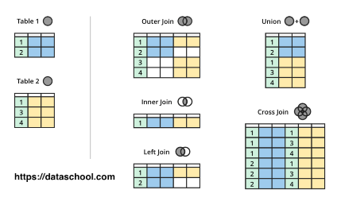

# SQL_JOIN


다음과 같은 테이블 종류를 가지고 조인 실습을 진행

#### topic

| tid  | title    | description     | author_id |
| ---- | -------- | --------------- | --------- |
| 1    | HTML     | html is...      | 1         |
| 2    | CSS      | css is ...      | 2         |
| 3    | Database | database is ... | 1         |
| 4    | oracle   | oracle is ...   | NULL      |


#### author

| aid  | name     | city   | profile_id |
| ---- | -------- | ------ | ---------- |
| 1    | egoing   | seoul  | 1          |
| 2    | leezche  | jeju   | 2          |
| 3    | blackdew | namhae | 3          |


#### profile

| pid  | title     | descruption     |
| ---- | --------- | --------------- |
| 1    | developer | developer is .. |
| 2    | designer  | designer is ..  |
| 3    | DBA       | DNA is ...      |


### LEFT OUTER JOIN

* 다음과 같은 형태로 조인을 하는 방법


```sql
SELECT * FROM topic LEFT JOIN author ON topic.author_id = author.aid
```

출력결과 


### 요약


